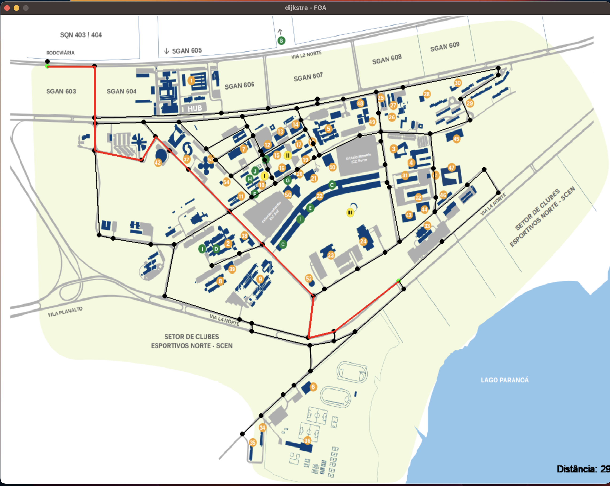
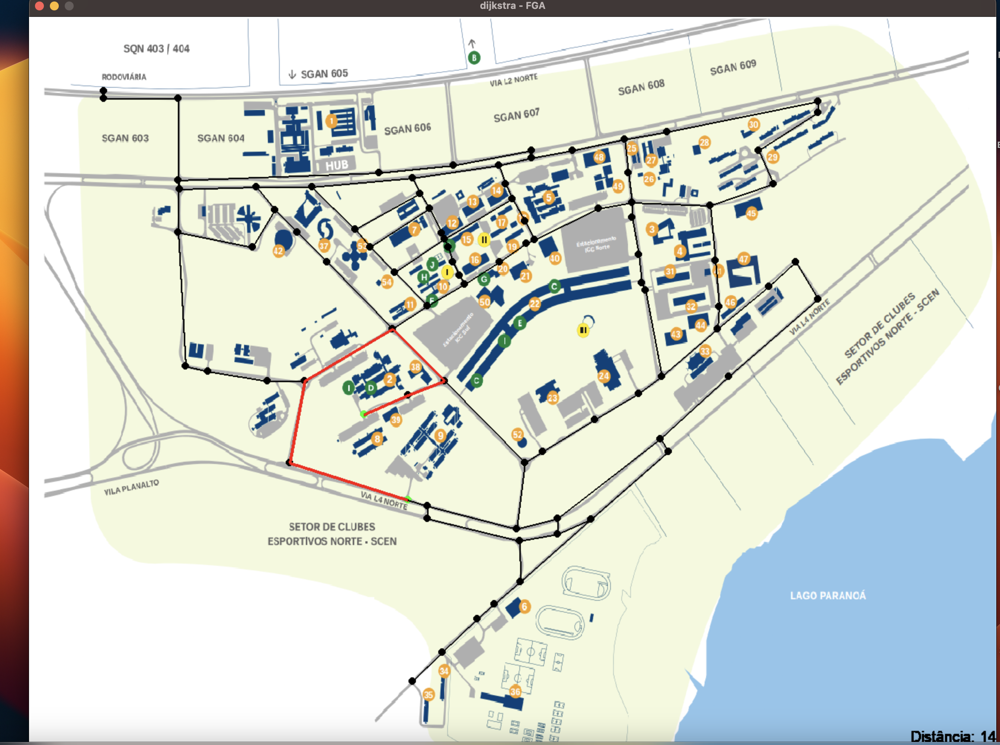
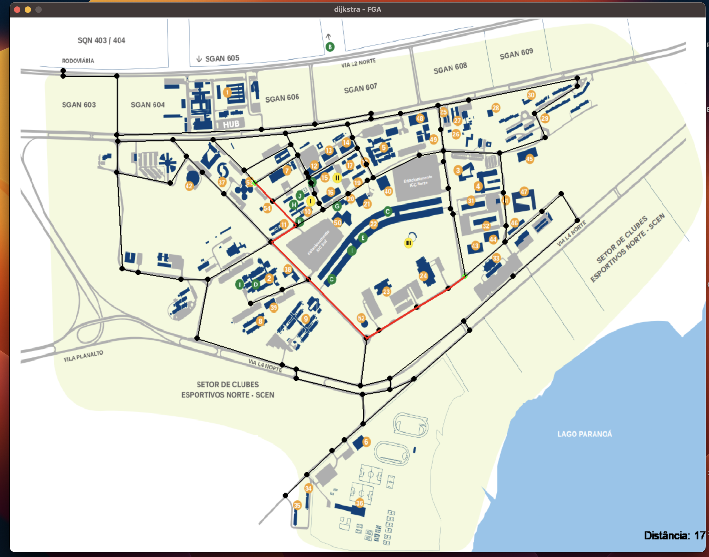

# Menor Caminho Dacry

**Número da Lista**: 30<br>
**Conteúdo da Disciplina**: Grafos2<br>

## Alunos
|Matrícula | Aluno |
| -- | -- |
| 20/2028211  |  Antônio Aldísio de Sousa Alves Ferreira Filho |
| 19/0048221  |  Rodrigo Balbino Azevedo de Brito |

## Sobre
O objetivo do projeto é utilizar o Pygame, uma biblioteca de desenvolvimento de jogos em Python, juntamente com o algoritmo de Dijkstra para demonstrar o menor caminho no campus Darcy Ribeiro.

## Screenshots



<br>



## Instalação
**Linguagem**: Python 3.10<br>

## Uso

Para instalar os pacotes necessários
```
pip3 install -r requirements.txt
```

Para rodar o projeto

```
python3 src/main.py
```


